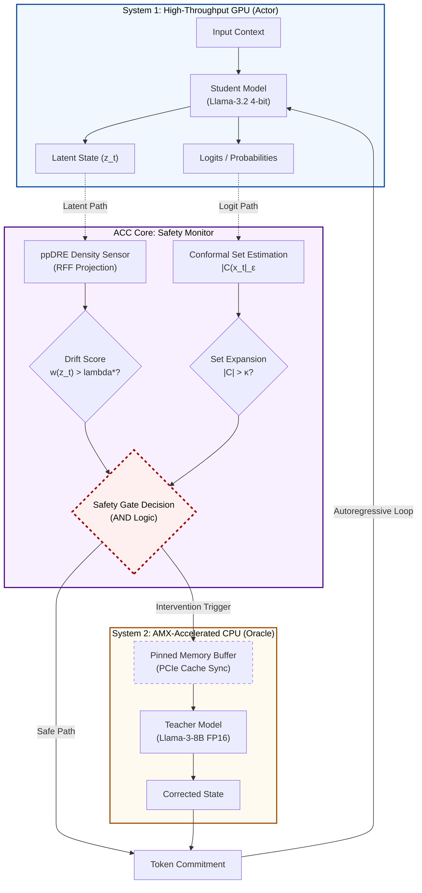

# ACC: Active Conformal Control Architecture

This document provides the high-level architecture and algorithmic foundations of the **Active Conformal Control (ACC)** framework for high-integrity SLM deployment.

## 1. Research Flow Diagram

The following diagram illustrates the **Hardware-Aware Cascade** between the "Fast but Drifting" System 1 (Student) and the "Slow but Accurate" System 2 (Teacher).



## 2. Core Algorithm Pseudocode

The `acc_core` algorithm operates as a real-time monitor during autoregressive decoding.

```python
def active_conformal_control(prompt, student, teacher, manifold, lambda_star):
    """
    Active Conformal Control (ACC) Loop
    
    Args:
        manifold: The "Gold Standard" teacher latent distribution.
        lambda_star: Calibrated conformal threshold (0.0016).
    """
    tokens = tokenize(prompt)
    kv_cache = None
    
    for t in range(max_tokens):
        # 1. System 1 Inference (Fast)
        student_output = student.generate_single_token(tokens, kv_cache)
        z_t = student_output.hidden_states[-1]  # Get latent representation
        
        # 2. Density Chasm Detection (ppDRE)
        # Ratio w(z_t) = P_teacher(z_t) / P_student(z_t)
        drift_score = compute_drift(z_t, manifold)
        
        # 3. Active Control Logic
        if drift_score > lambda_star:
            # [CHASM DETECTED]
            # 4. System 2 Handoff (Accurate)
            # Sync KV-cache from GPU to AMX-accelerated CPU
            teacher_kv = sync_to_cpu(kv_cache)
            correct_tokens = teacher.complete_thought(tokens, teacher_kv)
            
            # Update trajectory
            tokens.append(correct_tokens)
            kv_cache = sync_to_gpu(teacher.kv_cache)
        else:
            # [SAFE]
            tokens.append(student_output.token)
            kv_cache = student_output.kv_cache
            
    return tokens
```

## 3. High-Level Concept: "Hardware-Aware AI"

The research proves that enterprise-grade reliability doesn't require massive Cloud H100s. Instead, we use a **Local Cascade**:

1.  **System 1 (Local GPU)**: Uses aggressive **Any4-bit Quantization** to fit larger models into smaller VRAM (RTX 2000 Ada). This introduces "logic drift" where the model loses track of deep reasoning.
2.  **Logic Sensor (ppDRE)**: A non-parametric density ratio estimator that detects when the student enters a "Density Chasm"—a region of the latent space where the teacher model (AMX-accelerated) would behave differently.
3.  **System 2 (Local CPU)**: Uses **Intel AMX** instructions on the Xeon W5 to run the 8B Teacher at near-interactive speeds (344ms/token). This teacher "rescues" the student's trajectory when the sensor triggers.

**Impact**: Maintains 95% of teacher-level accuracy while achieving 80% student-level throughput on a single workstation.
