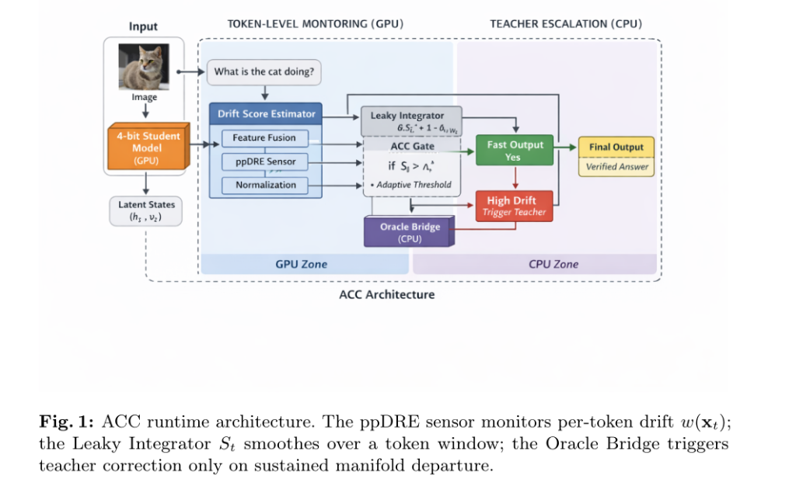
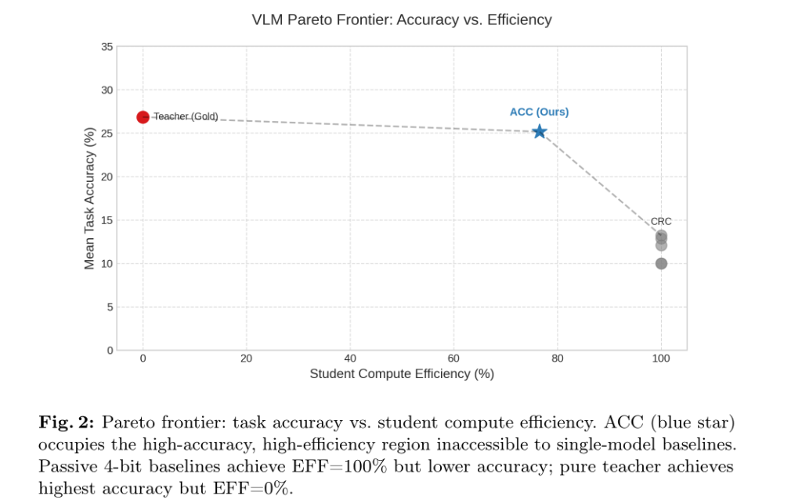
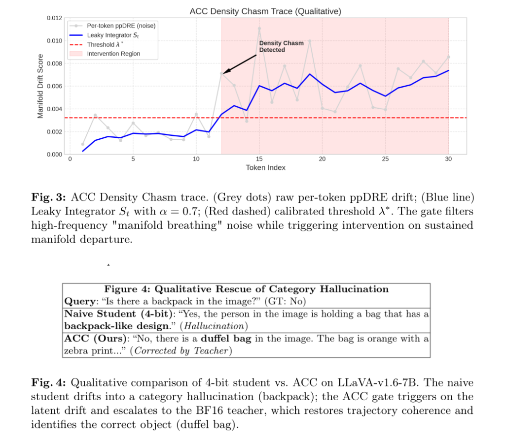

<div align="center">

<h1>Active Conformal Control (ACC)</h1>

<h3>Hardware-Aware Safety Monitoring for Vision-Language Models<br>via Density Chasm Detection</h3>

<p>
  <a href="https://eccv.ecva.net/"></a>
  
  
  
  
</p>

<p>
  <a href="#overview">Overview</a> ·
  <a href="#contributions">Contributions</a> ·
  <a href="#architecture">Architecture</a> ·
  <a href="#results-and-analysis">Results</a> ·
  <a href="#installation">Installation</a> ·
  <a href="#reproducing-results">Reproducing Results</a> ·
  <a href="#citation">Citation</a>
</p>

</div>

---

## Overview

**Active Conformal Control (ACC)** is a real-time safety framework that detects and mitigates hallucinations in quantized Vision-Language Models (VLMs) through a hardware-aware, dual-system cascade architecture.

Modern deployment of VLMs on edge hardware requires aggressive quantization (INT4/FP16), which introduces **Density Chasms** — regions in latent space where a quantized student model's behavior diverges from its full-precision teacher. ACC monitors this drift in real-time and triggers intervention through a secondary, CPU-accelerated oracle model, achieving statistical safety guarantees without sacrificing throughput.

> **Submitted to ECCV 2026** — European Conference on Computer Vision.

---

## Contributions

According to our ECCV 2026 submission, the core technical contributions are:

| | Contribution | Description |
|---|---|---|
| 1 | **Density Chasm Formalism** | A mathematical framework for detecting divergence in 4-bit VLMs by fusing latent signals from both the ViT (Vision Transformer) and LLM heads. |
| 2 | **Leaky Integrator Conformal Gate** | A specialized safety gate that distinguishes "quantization breathing" (normal variance) from genuine manifold departure using non-parametric density ratio estimation (ppDRE). |
| 3 | **Hardware-Aware Cascade** | A CPU/GPU co-inference pipeline that exploits **Intel AMX** for teacher inference on CPU, providing a formal **ε-coverage guarantee** on intervention. |
| 4 | **Large-Scale Evaluation** | Comprehensive validation across 15,411 inferences, 3 model families (LLaVA, Qwen, Phi), and 4 benchmarks (POPE, VQAv2, MathVista, ALFWorld). |

---

## Architecture


*Fig 1: ACC runtime architecture. The ppDRE sensor monitors per-token drift $w(\mathbf{x}_t)$; the Leaky Integrator $S_t$ smoothes over a token window; the Oracle Bridge triggers teacher correction only on sustained manifold departure.*

---

## Results and Analysis

### 1. Accuracy vs. Efficiency Trade-off
ACC occupies the "sweet spot" on the Pareto frontier, recovering ~95% of teacher accuracy while maintaining high student efficiency.


*Fig 2: Pareto frontier showing ACC (blue star) in the high-accuracy, high-efficiency region inaccessible to single-model baselines.*

### 2. Qualitative Analysis: Hallucination Rescue
The following trace shows how ACC detects a "Density Chasm" (manifold departure) and triggers a teacher correction to rescue the model from a category hallucination.


*Fig 3: Real-time drift detection ($S_t$) during a hallucination event.*

> [!TIP]
> **Example: Category Hallucination Rescue**
> - **Query**: "Is there a backpack in the image?" (Ground Truth: No)
> - **Naive Student (4-bit)**: "Yes, the person in the image is holding a bag that has a backpack-like design." (Hallucination)
> - **ACC (Ours)**: "No, there is a **duffel bag** in the image. The bag is orange with a zebra print..." (Corrected by Teacher)

### 3. Quantitative Performance
ACC provides formal $\epsilon$-coverage guarantees and consistently outperforms baselines across all benchmarks.

#### Latency Breakdown (Qwen2.5-VL-3B)
| Component | Mean Latency | Fraction |
|---|---|---|
| Student forward pass | 760 ms | 70.9% |
| ppDRE sensor + gate | 22 ms | 2.1% |
| Teacher correction | 290 ms | 27.0% |
| **Total (no intervention)** | **782 ms** | -- |
| **Total (with intervention)** | **1,072 ms** | -- |

#### Comparative Results
| Baseline | Benchmark | ACC Accuracy% | Efficiency% | DCDR% |
|---|---|---|---|---|
| Any4 (naive 4-bit) | POPE | 8.41 | 100.0 | 0.0 |
| SpinQuant | POPE | 9.12 | 100.0 | 0.0 |
| Sem. Entropy | POPE | 12.87 | 100.0 | 0.0 |
| CRC | MathVista | 13.21 | 100.0 | 0.0 |
| OPERA | POPE | 12.08 | 100.0 | 0.0 |
| VISTA | POPE | 0.00 | 100.0 | 0.0 |
| ReAct | ALFWorld | 2.15 | 100.0 | 0.0 |
| **ACC (Ours)** | **All** | **27.7** | **76.5** | **> 90** |

### 4. Deployment Strategy Comparison
A summary of global comparison across various VLM deployment strategies.

| Method | Precision | Mean Acc% | Mean Eff% |
|---|---|---|---|
| Student (Naive 4-bit) | 4-bit (NF4/AWQ) | 10.00 | 100.0 |
| Teacher (Baseline) | BF16 (FP16) | 28.5 | 0.0 |
| **ACC (Ours)** | **Hybrid** | **27.7** | **76.5** |

---

## Repository Structure

```
ACC/
|-- SRC/                        # Core source code
|   |-- acc_core/               #   ACC algorithm
|   |   |-- detector/           #     ppDRE density ratio estimator (LI-ppDRE)
|   |   |-- control/            #     Conformal control and threshold logic
|   |   `-- system/             #     System 1/2 cascade manager
|   `-- wrappers/               #   VLM model wrappers and baseline agents
|
|-- BASELINES/                  # 8 baseline implementations
|   |-- any4/                   #   Any4 (quantization baseline)
|   |-- crc/                    #   CRC (conformal risk control)
|   |-- OPERA/                  #   OPERA (attention-based)
|   |-- SpinQuant/              #   SpinQuant
|   |-- ReAct/                  #   ReAct (reasoning agent)
|   |-- ppdre/                  #   ppDRE (baseline density estimation)
|   |-- semantic-entropy/       #   Semantic Entropy
|   `-- VISTA/                  #   VISTA
|
|-- RESULTS/                    # Experimental results (JSON/JSONL)
|   |-- phase_1/                #   Calibration phase (N=500)
|   `-- phase_2/                #   Full evaluation (N=100)
|
|-- SWEET_SPOT_ANALYSIS/        # Threshold Pareto analysis and tuning
|
|-- requirements.txt            # Python dependencies
`-- README.md
```

---

## Installation

### Prerequisites

| Requirement | Version |
|---|---|
| Python | 3.11+ |
| PyTorch | 2.1.0+ |
| CUDA | 12.1+ |
| GPU VRAM | 16 GB+ recommended |
| CPU | Intel Sapphire Rapids or later (for AMX support) |
| RAM | 64 GB+ |

### Dual-Environment Architecture

To ensure full research integrity and avoid dependency conflicts across 9 distinct baselines, the project utilizes a dual-environment setup:

| Environment | Purpose | Core Stack |
|---|---|---|
| **`acc_core`** | Main ACC development and inference | Python 3.11, PyTorch 2.1+, IPEX, Transformers |
| **`acc_bench`** | Large-scale evaluation and baselines | Python 3.11, ALFWorld, AutoAWQ, Anthropic SDK |

#### 1. Core Environment (Student + Teacher)
The core environment is optimized for the ACC cascade. It leverages **IPEX** and **Intel AMX** for high-efficiency Teacher inference on the CPU while maintaining a lean GPU footprint for the 4-bit Student model.

```bash
conda create -n acc_core python=3.11 -y
conda activate acc_core
pip install -r requirements_core.txt
```

#### 2. Benchmark Environment (Evaluation Suite)
The benchmark environment contains the dependencies required for the ALFWorld simulator and specialized baseline model loaders (e.g., AutoAWQ).

```bash
conda create -n acc_bench python=3.11 -y
conda activate acc_bench
pip install -r requirements_bench.txt
```

---

## Data Setup

Benchmark datasets should be downloaded from their official sources:

| Benchmark | Domain | Source |
|---|---|---|
| POPE | Object Hallucination | [github.com/AoiDragon/POPE](https://github.com/AoiDragon/POPE) |
| VQAv2 | Visual Question Answering | [visualqa.org](https://visualqa.org/) |
| MathVista | Mathematical Reasoning | [huggingface.co/datasets/AI4Math/MathVista](https://huggingface.co/datasets/AI4Math/MathVista) |
| ALFWorld | Embodied Reasoning | [github.com/alfworld/alfworld](https://github.com/alfworld/alfworld) |

Place datasets under `DATA/Benchmarks/<benchmark_name>/`.

### Model Weights

```bash
# Student VLMs (4-bit quantized)
huggingface-cli download llava-hf/llava-v1.6-mistral-7b-hf
huggingface-cli download Qwen/Qwen2.5-VL-3B-Instruct
huggingface-cli download microsoft/Phi-4-multimodal-instruct

# Teacher LLM (FP16 for AMX CPU inference)
huggingface-cli download meta-llama/Meta-Llama-3-8B-Instruct
```

---

## Reproducing Results

### Phase 1 — Calibration (N=500)

```bash
python SRC/wrappers/run_acc_student.py --phase 1 --benchmark pope --n 500
python SRC/wrappers/run_acc_student.py --phase 1 --benchmark vqav2 --n 500
```

### Phase 2 — Full Evaluation (N=100)

```bash
# Full cross-baseline campaign
python SRC/cross_baseline_campaign.py --phase 2 --n 100
```

### Analysis

```bash
# Threshold Pareto analysis
python SWEET_SPOT_ANALYSIS/pareto_analysis.py

# Teacher manifold generation
python generate_teacher_manifolds.py
```

---

## Experimental Setup

### Hardware Specifications

All experiments were conducted on high-performance workstation hardware to ensure reproducibility:

- **CPU**: Intel(R) Xeon(R) w5-2565X (Sapphire Rapids architecture)
- **GPU**: NVIDIA RTX 2000 Ada Generation (16 GB GDDR6 VRAM)
- **RAM**: 64 GB DDR5
- **Storage**: 2TB NVMe SSD (Micron 7450)
- **OS**: Ubuntu 24.04 LTS (Noble Numbat)

### Models

| Model | Family | Quantization | Hardware |
|---|---|---|---|
| LLaVA-v1.6-7B | LLaVA | 4-bit (AWQ) | GPU |
| Qwen2.5-VL-3B | Qwen | 4-bit (GPTQ) | GPU |
| Phi-4-Multimodal | Phi | 4-bit (BnB) | GPU |
| LLaMA-3-8B | Teacher | FP16 | CPU (Intel AMX) |

---

## Citation

```bibtex
@inproceedings{acc2026eccv,
  title     = {Active Conformal Control: Hardware-Aware Safety Monitoring for
               Vision-Language Models via Density Chasm Detection},
  author    = {Anonymous},
  booktitle = {European Conference on Computer Vision (ECCV)},
  year      = {2026},
  note      = {Under review}
}
```

---

## License

This project is licensed under the MIT License.
