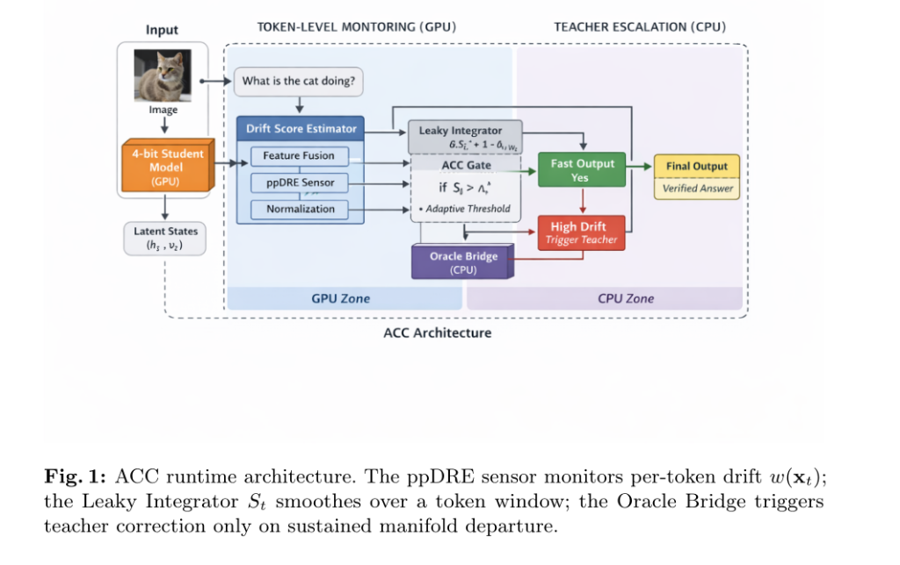
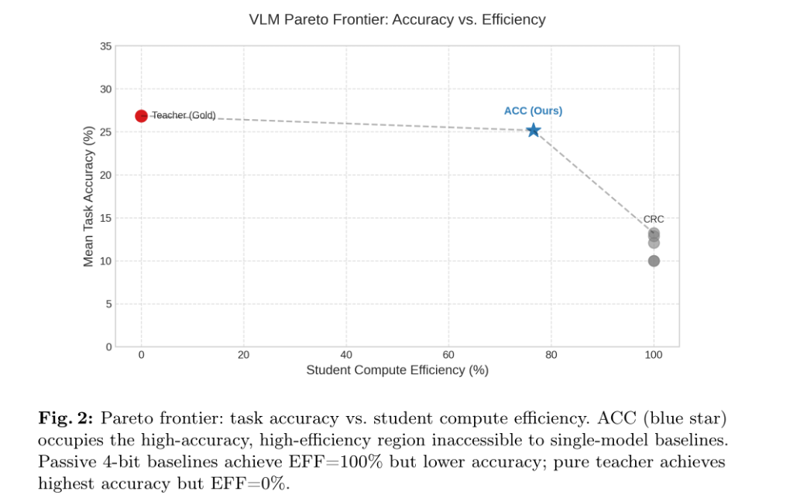
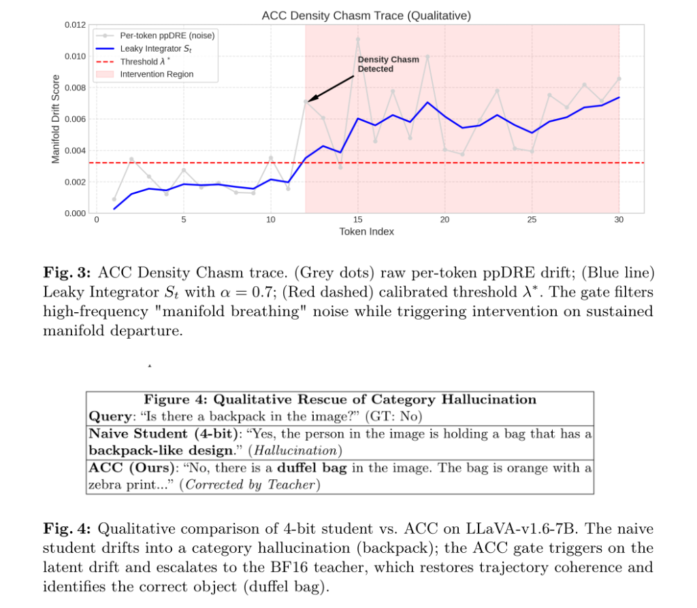

<div align="center">

<h1>Active Conformal Control (ActiveCC)</h1>

<h3>Runtime Safety Monitoring for Quantized Vision-Language Models<br>via Density Chasm Detection</h3>

<p>
  <a href="https://openreview.net/"></a>
  
  
  
  
</p>

<p>
  <a href="#overview">Overview</a> ·
  <a href="#contributions">Contributions</a> ·
  <a href="#architecture">Architecture</a> ·
  <a href="#results">Results</a> ·
  <a href="#installation">Installation</a> ·
  <a href="#reproducing-results">Reproducing Results</a> ·
  <a href="#citation">Citation</a>
</p>

</div>

---

## Overview

**Active Conformal Control (ActiveCC)** is a runtime monitoring framework that detects and mitigates hallucinations in 4-bit quantized Vision-Language Models (VLMs) through a hardware-aware, dual-system cascade architecture.

Aggressive 4-bit quantization compresses VLMs to fit within 16 GB VRAM budgets, but introduces **Density Chasms** — geometric distortions of the latent manifold where the quantized student model's token trajectories diverge from the safe distribution. ActiveCC monitors this drift per-token using **Projection Pursuit Density Ratio Estimation (ppDRE)**, applies a **Leaky Integrator Conformal Drift Gate (CDG)** with a formal statistical coverage guarantee, and selectively escalates failing inferences to a BF16-precision teacher model running on CPU with Intel AMX acceleration.

> **Submitted to IEEE Open Journal of the Computer Society (IEEE OJCS)**
> Authors: Krishnamurthi Ramesh, K E Srinivasa Desikan
> Department of Computer Science and Engineering, Indian Institute of Information Technology Design and Manufacturing Kurnool

---

## Contributions

| # | Contribution | Description |
|---|---|---|
| 1 | **Density Chasm Formalisation** | First token-level drift characterisation for multimodal models: fusing ViT query projections and LLM hidden states into a unified relative drift score $E_{rel}$ via ppDRE. |
| 2 | **Leaky Integrator CDG with Formal Guarantees** | IIR-filter interpretation of the conformal threshold check; formal per-token coverage guarantee $\Pr[w(x_t)>\lambda^*]\leq 0.052$ (Theorem 1) and $\geq 5.4\times$ breathing suppression (Proposition 1). |
| 3 | **VLM Student-Teacher Cascade with Architecture Isolation** | Hardware-aware cascade on a single commercial workstation; same-family teacher ablation demonstrating **16.2 pp improvement** attributable to the CDG mechanism alone (independent of teacher architecture). |
| 4 | **Multi-Quantization Generalisation** | ActiveCC generalises across 3-bit, 4-bit, 6-bit, and 8-bit quantization with per-precision threshold calibration. |
| 5 | **Extensive Multi-Benchmark Evaluation** | 15,411 total inferences across 3 student VLMs and 4 benchmarks, evaluated against 9 baselines with $p<0.01$ statistical significance. |

---

## Architecture


*Fig 1: ActiveCC runtime architecture. The ppDRE sensor monitors per-token drift $w(\mathbf{x}_t)$; the Leaky Integrator $S_t$ smoothes over a token window; the CDG triggers teacher correction only on sustained manifold departure.*

---

## Results

### Accuracy vs. Efficiency Trade-off

ActiveCC occupies the Pareto-optimal region, outperforming all single-model baselines.


*Fig 2: Pareto frontier. ActiveCC (blue star) outperforms the naive 4-bit student fleet mean (30.8%) by 7.0 pp and the BF16 teacher-only baseline (33.9%) by 3.9 pp at 75.3% student compute fraction.*

### Qualitative Analysis: Hallucination Rescue

> **Example: Category Hallucination Rescue**
> - **Query**: "Is there a backpack in the image?" (Ground Truth: No)
> - **Naive 4-bit Student**: "Yes, the person in the image is holding a bag that has a backpack-like design." *(Hallucination)*
> - **ActiveCC**: "No, there is a **duffel bag** in the image. The bag is orange with a zebra print..." *(Corrected)*


*Fig 3: Real-time drift detection ($S_t$) during a hallucination event. The CDG fires before the student commits to the erroneous output.*

### Quantitative Performance Summary

**Table 1: Naive 4-bit Student Baselines (No ActiveCC)**

| Model | POPE (%) | VQAv2 (%) | MathVista (%) | ALFWorld (%) | Model Mean (%) |
|---|---|---|---|---|---|
| Qwen2.5-VL-3B (AWQ) | 61.7 | 39.1 | 8.2 | 0.0 | 27.3 |
| Phi-4-Multimodal (NF4) | 64.3 | 36.8 | 24.1 | 0.0 | 31.3 |
| LLaVA-v1.6-7B (NF4) | 71.2 | 38.4 | 10.9 | 14.8 | 33.8 |
| **Fleet Mean** | | | | | **30.8** |

**Table 2: ActiveCC Fleet Performance (Phase 2)**

| Model | POPE (%) | VQAv2 (%) | MathVista (%) | ALFWorld (%) | SCF (%) | Model Mean (%) |
|---|---|---|---|---|---|---|
| Qwen2.5-VL-3B | 83.1 | 41.3 | 13.4 | 0.0 | 80.6 | 34.5 |
| Phi-4-Multimodal | 81.8 | 38.2 | 26.8 | 0.0 | 99.1 | 36.7 |
| LLaVA-v1.6-7B | 81.2 | 43.7 | 12.7 | 31.7 | 46.2 | 42.3 |
| **Fleet Mean** | | | | | **75.3** | **37.8** |

**Table 3: Full Baseline Comparison (fleet-averaged, all 3 students × 4 benchmarks)**

| Method | Mean Acc (%) | SCF (%) | Formal Coverage |
|---|---|---|---|
| any4 (naive 4-bit) | 10.0 | 100.0 | No |
| SpinQuant | 11.3 | 100.0 | No |
| SmoothQuant | 12.1 | 100.0 | No |
| Semantic Entropy | 12.9 | 100.0 | No |
| CRC | 14.8 | 100.0 | Yes (post-hoc) |
| OPERA | 15.2 | 95.3 | No |
| AWQ | 13.6 | 100.0 | No |
| ReAct | 11.8 | 100.0 | No |
| Teacher (BF16, no student) | 33.9 | 0.0 | — |
| **ActiveCC (Ours)** | **37.8** | **75.3** | **Yes (per-token)** |

**Key result:** The same-family teacher ablation (CDG with BF16 unquantised student as teacher) achieves **31.4%** accuracy, outperforming the best non-CDG baseline (OPERA, 15.2%) by **16.2 pp** — directly isolating the detection mechanism's contribution, independent of the teacher architecture.

### Latency Breakdown (Qwen2.5-VL-3B, POPE, N=100)

| Component | Mean Latency | Fraction |
|---|---|---|
| Student forward pass (GPU) | 760 ms | 70.9% |
| ppDRE sensor + CDG gate | 22 ms | 2.1% |
| PEB handoff overhead | 41 ms | 3.8% |
| Teacher correction (CPU/AMX) | 310 ms | — |
| **Total (no intervention)** | **782 ms** | — |
| **Total (with intervention)** | **1,113 ms** | — |

---

## Repository Structure

```
ActiveCC/
|-- SRC/                        # Core source code
|   |-- acc_core/               #   ActiveCC algorithm
|   |   |-- detector/           #     ppDRE density ratio estimator
|   |   |-- control/            #     Conformal CDG threshold logic
|   |   `-- system/             #     Student/teacher cascade manager
|   `-- wrappers/               #   VLM model wrappers and baseline agents
|
|-- BASELINES/                  # Baseline implementations
|   |-- any4/                   #   any4 (learned 4-bit codebook, used in Table 3)
|   |-- conformal-risk-control/ #   CRC (post-hoc conformal risk control)
|   |-- OPERA/                  #   OPERA (attention head reweighting)
|   |-- SpinQuant/              #   SpinQuant (rotation-based quantization)
|   |-- ReAct/                  #   ReAct (reasoning agent baseline)
|   |-- ppdre/                  #   ppDRE-only ablation (alpha=0, no LI)
|   |-- semantic-entropy/       #   Semantic Entropy
|   `-- VISTA/                  #   VISTA (retained for reference; not included in Table 3)
|   NOTE: SmoothQuant and AWQ baselines use standard library implementations
|         (bitsandbytes / AutoAWQ) and do not require separate folders.
|
|-- RESULTS/                    # Experimental results (JSON/JSONL)
|   |-- phase_1/                #   Calibration phase results
|   `-- phase_2/                #   Full evaluation results
|
|-- SWEET_SPOT_ANALYSIS/        # Threshold Pareto analysis and tuning
|-- assets/                     # Figures used in README
|-- IEEE-open-journal-template/ # LaTeX manuscript source
|-- requirements_core.txt       # Core environment dependencies
|-- requirements_bench.txt      # Benchmark environment dependencies
`-- README.md
```

---

## Installation

### Hardware Requirements

| Component | Specification |
|---|---|
| GPU | NVIDIA RTX 2000 Ada Generation (16 GB GDDR6) — or any 16 GB VRAM GPU |
| CPU | Intel Xeon w5-2565X (Sapphire Rapids, 18-core/36-thread) with Intel AMX support |
| RAM | 64 GB DDR5 ECC (minimum; 22 GB reserved for teacher model at BF16) |
| Storage | 1 TB NVMe (OS + models) + additional storage for datasets |
| CUDA | 12.1+ |
| OS | Ubuntu 22.04 LTS or later |

### Software Requirements

| Requirement | Version |
|---|---|
| Python | 3.11+ |
| PyTorch | 2.1.0+ |
| Intel Extension for PyTorch (IPEX) | 2.1.0+ |
| Transformers | 4.40+ |

### Dual-Environment Architecture

To avoid dependency conflicts between the 9 distinct baselines, the project uses a dual-environment setup:

| Environment | Purpose | Core Stack |
|---|---|---|
| **`acc_core`** | Main ActiveCC development and inference | Python 3.11, PyTorch 2.1+, IPEX, Transformers |
| **`acc_bench`** | Large-scale evaluation and baselines | Python 3.11, ALFWorld, AutoAWQ, bitsandbytes |

#### 1. Core Environment (Student + Teacher Cascade)

```bash
conda create -n acc_core python=3.11 -y
conda activate acc_core
pip install -r requirements_core.txt
```

#### 2. Benchmark Environment (Evaluation Suite)

```bash
conda create -n acc_bench python=3.11 -y
conda activate acc_bench
pip install -r requirements_bench.txt
```

---

## Data Setup

Benchmark datasets should be downloaded from their official sources:

| Benchmark | Samples Used | Domain | Source |
|---|---|---|---|
| POPE | 3,001 | Object Hallucination | [github.com/AoiDragon/POPE](https://github.com/AoiDragon/POPE) |
| VQAv2 | 1,001 | Visual Question Answering | [visualqa.org](https://visualqa.org/) |
| MathVista | 1,000 | Mathematical Reasoning | [HuggingFace: AI4Math/MathVista](https://huggingface.co/datasets/AI4Math/MathVista) |
| ALFWorld | 135 | Embodied Reasoning | [github.com/alfworld/alfworld](https://github.com/alfworld/alfworld) |

Place datasets under `DATA/Benchmarks/<benchmark_name>/`.

### Model Weights

```bash
# Student VLMs (4-bit quantized — loaded via bitsandbytes/AutoAWQ)
huggingface-cli download llava-hf/llava-v1.6-vicuna-7b
huggingface-cli download Qwen/Qwen2.5-VL-3B-Instruct
huggingface-cli download microsoft/Phi-4-multimodal-instruct

# Teacher VLM (BF16 — multimodal, runs on CPU with Intel AMX)
# NOTE: The teacher is a vision-language model required for image-conditioned
# teacher correction. A text-only LLM cannot be used as the teacher.
huggingface-cli download meta-llama/Llama-3.2-11B-Vision-Instruct
```

> **Memory note:** The Llama-3.2-Vision-11B teacher requires approximately 22 GB DDR5 system RAM at BF16 precision. Ensure at least 32 GB system RAM is free before loading the teacher.

---

## Reproducing Results

### Phase 1 — CDG Calibration (N=512 calibration samples)

The calibration phase computes the conformal threshold λ* for each student model using a 512-sample neutral manifold sweep.

```bash
conda activate acc_core
python SRC/wrappers/run_acc_student.py --phase 1 --benchmark pope --n 512
python SRC/wrappers/run_acc_student.py --phase 1 --benchmark vqav2 --n 512
```

### Phase 2 — Full Evaluation

The paper reports results over the full benchmark sample sizes listed in the table above (total 15,411 inferences across 3 students × 4 benchmarks). The `--n` argument below controls per-benchmark-model samples; set to the values used in the paper for full reproduction.

```bash
conda activate acc_bench
# Full cross-baseline campaign (paper uses full benchmark sizes per table above)
python SRC/cross_baseline_campaign.py --phase 2 \
    --pope_n 910 --vqav2_n 1001 --mathvista_n 1000 --alfworld_n 135
```

For a quick smoke-test with N=100 per benchmark-model pair:
```bash
python SRC/cross_baseline_campaign.py --phase 2 --n 100
```

### Analysis

```bash
# Threshold Pareto analysis
python SWEET_SPOT_ANALYSIS/pareto_analysis.py

# Latent manifold visualisation
python generate_teacher_manifolds.py
```

---

## Experimental Setup

### Hardware Specifications

All experiments were conducted on a single commercial workstation:

| Component | Specification |
|---|---|
| **GPU** | NVIDIA RTX 2000 Ada Generation (16 GB GDDR6) — student inference |
| **CPU** | Intel Xeon w5-2565X (18-core/36-thread, Sapphire Rapids) — teacher inference via Intel AMX |
| **RAM** | 64 GB DDR5 ECC |
| **Storage** | 1 TB NVMe (Phison) for OS/models + 2 TB HDD (HGST) for datasets |
| **OS** | Ubuntu 24.04 LTS |

### Models

| Role | Model | Parameters | Precision | Hardware |
|---|---|---|---|---|
| Student | Qwen2.5-VL-3B-Instruct | 3B | 4-bit AWQ | GPU |
| Student | Phi-4-Multimodal-Instruct | 4.2B | 4-bit NF4 | GPU |
| Student | LLaVA-v1.6-Vicuna-7B | 7B | 4-bit NF4 | GPU |
| Teacher | Llama-3.2-Vision-11B | 11B | BF16 | CPU (Intel AMX) |

**Important:** The teacher model is a **multimodal** (vision-language) model. It processes both image and text inputs to generate corrected responses. A text-only LLM is not a valid substitute as it cannot condition on the image context that caused the original student failure.

### Prompting Templates (Zero-shot)

| Benchmark | Template |
|---|---|
| POPE | `[Image] Please answer Yes or No. Is there a {object} in the image?` |
| VQAv2 | `[Image] {question} Answer concisely.` |
| MathVista | `[Image] {question} Let's think step by step.` |
| ALFWorld | `[Task] {task_description} What is your next action?` |

VQAv2 results use the official **consensus scoring** protocol (majority vote over 10 human annotations), not exact-match.

---

## Baseline Notes

| Baseline | Implementation |
|---|---|
| any4 | `BASELINES/any4/` |
| SpinQuant | `BASELINES/SpinQuant/` |
| SmoothQuant | Standard `bitsandbytes` / activation scaling — no separate folder needed |
| Semantic Entropy | `BASELINES/semantic-entropy/` |
| CRC | `BASELINES/conformal-risk-control/` |
| OPERA | `BASELINES/OPERA/` |
| AWQ | Standard `AutoAWQ` library — no separate folder needed |
| ReAct | `BASELINES/ReAct/` |
| ppDRE-only ablation | `BASELINES/ppdre/` |

---

## Citation

```bibtex
@article{ramesh2026activecc,
  title   = {Active Conformal Control: Navigating Density Chasms in
             Quantized Vision-Language Systems},
  author  = {Ramesh, Krishnamurthi and Desikan, K E Srinivasa},
  journal = {IEEE Open Journal of the Computer Society},
  year    = {2026},
  note    = {Under review}
}
```

---

## License

This project is licensed under the MIT License.
